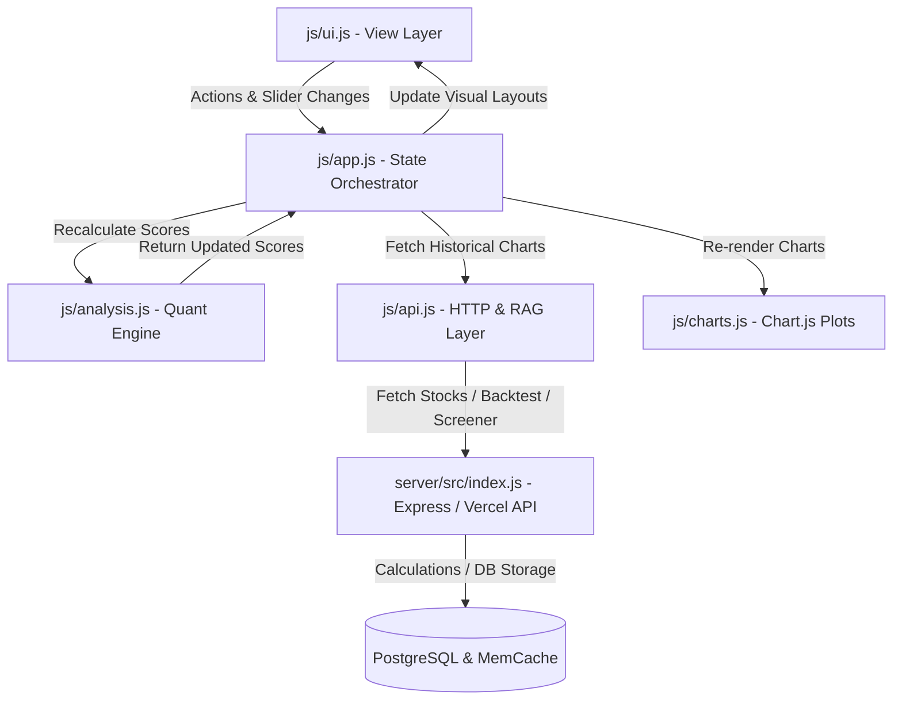

# System Architecture & Implementation Plan - Swing Trading App Upgrades (Phase 6)

This document outlines the system architecture and implementation strategy to upgrade the dashboard into a Tier-1 institutional-grade quantitative platform. It introduces dynamic custom screening, a backtesting engine, time-series score tracking, a modular slider weighting system, and automated market regime filters.

---

## 1. Modular Architecture & State Design

To maintain the high-performance, single-page application (SPA) nature of the dashboard, the Vanilla JS state and module communication will be structured as follows:



### Global State Structure (`js/app.js`)
We will expand the client-side state object to include the configuration settings for the new modules:
```javascript
const state = {
  watchlist: [],            // Saved symbols [{ symbol, name }]
  results: new Map(),       // Active detailed analysis results [symbol -> AnalysisResult]
  catalogResults: new Map(),// Scanned background catalog quotes [symbol -> ScannedQuote]
  activeSymbol: null,       // Currently active detail stock symbol
  marketMode: 'IN',         // 'IN' (Nifty) or 'US' (S&P)
  recFilter: 'all',         // Active filter ('all', 'buy', 'watch', 'confluence')
  loading: new Set(),       // Active loading tickers
  isAuthenticated: false,   // Auth status
  alerts: [],               // Indicator price alerts

  // --- NEW QUANT MODULE CONFIGURATIONS ---
  weights: {
    fundamental: 25,        // % contribution (default: 25%)
    technical: 30,          // % contribution (default: 30%)
    momentum: 20,           // % contribution (default: 20%)
    sentiment: 10,          // % contribution (default: 10%)
    institutional: 15       // % contribution (default: 15%)
  },
  regime: 'auto',           // 'auto' (200 SMA tracking), 'bull' (manual), 'bear' (manual)
  activeRegime: 'bull',     // Detected regime ('bull' or 'bear')
  
  screener: {
    filters: [],            // Custom active screener filters [{ metric, operator, value }]
    results: []             // Screened stock results
  },
  backtest: {
    params: {
      threshold: 80,        // Score trigger limit
      holdingPeriod: 30,    // Sell delay in calendar days
      lookback: 365         // Days of historical data
    },
    results: null           // Performance statistics { winRate, avgReturn, alpha }
  }
};
```

---

## 2. Core Upgrades Specification

### Component 1: Dynamic Custom Screener (Trendlyne style)
- **Objective**: Replace fixed 130 stocks list scanning with dynamic multi-metric queries.
- **Frontend UI**:
  - Add a "Screener" tab inside recommendations panel or side sub-tab.
  - Custom Filter Builder: Add filter rows where user selects `Metric`, `Operator` (Greater Than, Less Than, Equals), and enters a `Value`.
  - Supported filters: `Market Cap > X Cr`, `RSI < Y`, `Volume Ratio > Z`, `Price > P`, `FII Flow Score > F`.
  - Result table showing matched symbols, prices, scores, and buttons to add directly to watchlist.
- **Backend API**:
  - Add endpoint `POST /api/screener/query` that evaluates matches against a cached database or local in-memory catalog assets.
  - To support a wider stock universe, the backend stock list will be expanded to 300+ highly active NSE and US tickers, maintaining their scraped data inside `appCache`.

### Component 2: Backtesting Engine (Trendlyne style)
- **Objective**: Prove the statistical edge of the scoring model by running historical simulations.
- **Logic**:
  - Fetch historical 1-year daily close data for catalog stocks (via Yahoo Finance `/v8/finance/chart` endpoint).
  - Reconstruct the historical daily Composite Score by calculating technical indicators (RSI, SMA crossovers, Bollinger bands) dynamically for past daily bars, combined with the stock's fundamental score baseline.
  - Trigger "Buy" signals when the Composite Score crosses above the selected `Threshold`.
  - Trigger "Sell" exits after `Holding Period` days.
  - Compute performance statistics:
    - **Win Rate %** (percentage of profitable trades).
    - **Average Return %** per trade.
    - **Total Trade Count**.
    - **Benchmark Comparison** (Relative outperformance against Nifty 50 or S&P 500 index return over the same period).
- **UI Render**: Add a "Backtester" widget displaying clean stats grids, bar chart comparison, and trade signal count.

### Component 3: Historical Score Time-Series Chart (Koyfin style)
- **Objective**: Display the trajectory of the stock’s rating over time (is the score improving or deteriorating?).
- **Implementation**:
  - Add a second Chart.js line canvas `#chart-historical-score` underneath the main price chart (placed inside the sub-tab metric panel).
  - Calculate historical Daily Composite Scores for the active stock over the selected lookback range (e.g. 6 months).
  - Plot the scores as a continuous time-series line, color-coding the background zones:
    - **Buy Zone (> 70)**: Light translucent green.
    - **Neutral Zone (50 - 70)**: Translucent yellow/gray.
    - **Avoid Zone (< 50)**: Light translucent red.

### Component 4: Modular Weighting System (Koyfin style)
- **Objective**: Allow users to customize how different factors contribute to the final stock score.
- **Implementation**:
  - Insert a slider panel under `#recommendations-filters` showing sliders for all 5 tracks:
    - Fundamentals, Technical Setup, Momentum, Sentiment, Institutional.
  - **Dynamic Scaling**: As the user drags one slider, the other sliders adjust proportionally to ensure the total is locked at exactly 100%. Alternatively, show a warning toast if the sum deviates.
  - Recalculate all scores on the client-side (`js/analysis.js`) and update watchlist rankings and recommendation cards instantly without requesting a server reload.

### Component 5: Market Regime Filter (Advanced Alpha)
- **Objective**: Adapt scoring behavior to different phases of the market cycle.
- **Backend Detection**:
  - Query Nifty 50 index (`^NSEI` for India) or S&P 500 (`^GSPC` for US).
  - Calculate Nifty's 200-day Simple Moving Average (SMA).
  - **Bull Regime**: Index Price $\ge$ 200 SMA.
  - **Bear Regime**: Index Price < 200 SMA.
- **Scoring Rules Overrides**:
  - If regime is **Bear**:
    - Penalize technical breakout momentum (technicals & momentum score contribution scaled by `0.7x` to filter out bear-market false breakouts).
    - Boost fundamental valuation parameters (fundamentals score contribution scaled by `1.3x` to prioritize margin of safety).
    - Normalize the resulting composite score back to a 100-point scale.
  - Add a high-visibility badge in the header displaying detected regime status: "🐂 BULL MARKET" or "🐻 BEAR REGIME".

---

## 3. Proposed Changes by File

### [MODIFY] [index.html](index.html)
- Add sliders interface and layout markup for the Modular Weighting Panel.
- Insert market regime status badges in the header.
- Add "Screener" query builder inputs and table markup.
- Append a backtest parameters config pane and results container.
- Embed `#chart-historical-score` canvas in the stock metrics detail panel.

### [MODIFY] [css/style.css](css/style.css)
- Style the screener grid rows, backtester results tables, and slider cards.
- Add regime status visual animations (e.g. green pulse for Bull, red for Bear).

### [MODIFY] [js/analysis.js](js/analysis.js)
- Update `calculateCompositeScore` to accept dynamic slider weights parameters.
- Incorporate market regime multipliers (`0.7x` momentum / `1.3x` value) when computing scores.
- Export historical scoring calculation routines for time-series charting.

### [MODIFY] [js/charts.js](js/charts.js)
- Build the `#chart-historical-score` timeline chart layout with colored background threshold zones.

### [MODIFY] [js/app.js](js/app.js)
- Wire slider event handlers to automatically adjust values, save to `localStorage`, and trigger real-time scores recalculation.
- Integrate the regime detection checks during Nifty/S&P index loads.
- Map screener filter execution queries and backtesting triggers.

### [MODIFY] [js/api.js](js/api.js)
- Expand the client-side stock catalog to support a larger 300+ stock universe.
- Add API triggers to query screener rules and fetch historical prices for backtests.

### [MODIFY] [server/src/index.js](server/src/index.js) & [api/index.js](api/index.js)
- Add `/api/screener/query` endpoint.
- Implement backend `/api/backtest` simulator using historical Yahoo Finance quote fetches.
- Include Nifty/S&P 200 SMA calculations inside `/api/market-summary` to feed the market regime detector.

---

## 4. Verification Plan

### Automated / Manual Tests
1. **Regime Gating**: Verify that when Bear regime is simulated, Momentum scores are lower and Fundamental scores are higher for the same assets.
2. **Slider Recalculation**: Adjust the Technical weight to 60% and Fundamentals to 0%. Verify that the scores and watchlist sorting order change immediately on screen without fetching new data.
3. **Historical Score Graph**: Open a stock and confirm the historical score line chart renders correctly.
4. **Custom Screener**: Run a query like `RSI < 30` and verify the table shows correct results matching the condition.
5. **Backtester**: Trigger a backtest for `Score > 80` and ensure it computes the Win Rate %, average returns, and signals count correctly.

---

## 5. Open Questions for User Review

> [!IMPORTANT]
> 1. **Index for Regime Detector**: For Indian market mode, we will use Nifty 50 (`^NSEI`). For US market mode, we will use S&P 500 (`^GSPC`). Is this acceptable?
> 2. **Auto-Balancing Slider Behavior**: When a user changes one slider, should we adjust the other sliders proportionally to maintain a sum of 100% (highly premium Koyfin experience), or should we just show a total value indicator and warn the user if it doesn't equal 100%? We recommend auto-proportional balancing.
